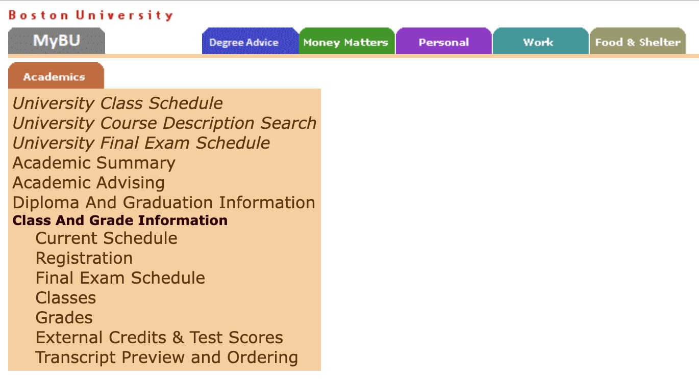
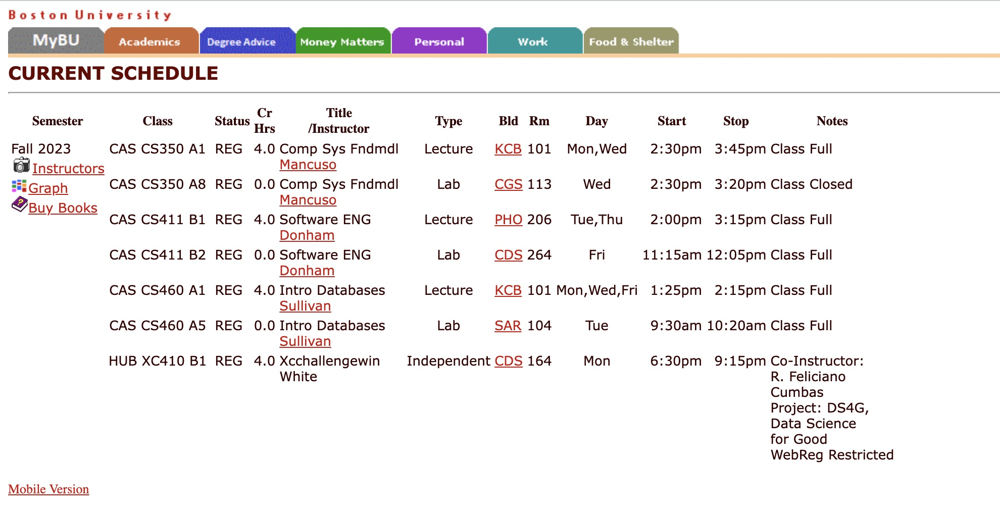
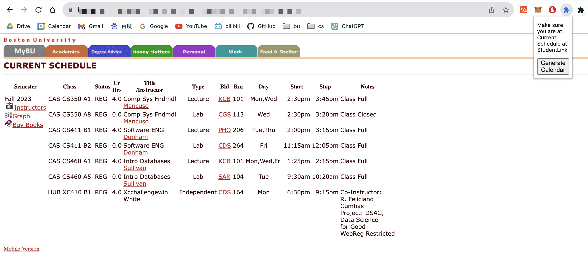

# BUCalendarGenerator
---
## Introduction
This Google Chrome extension allows Boston Univeristy(BU) students to generate calendar file for their class schedule with just a click.

## Instructions
1. Open StudentLink and click **Current Schedule** Under **Academics**<br>
    
2. Be sure you are at **Current Schedule** before you use the extension<br>

3. Click the extension icon and click **Generate Calendar**<br>

4. Then save ```bu_calendar.ics``` to anywhere you can find on your computer
5. Draw ```bu_calendar.ics``` to your calendar app (for those who use Google Calendar, here is the link to the instruction: [link](https://support.google.com/calendar/answer/37118?hl=en&co=GENIE.Platform%3DDesktop))